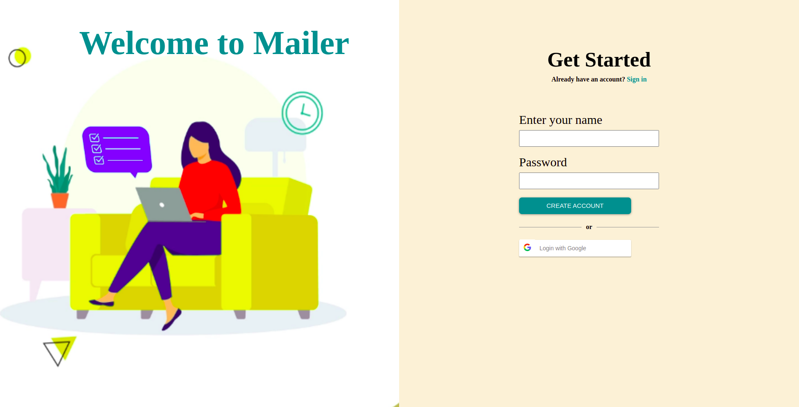

# Mailer

## Description

A mailing app with user authentication

## Features

- List of scheduled mails
- List of mail sent
- can write new mail

## Visit At

## Installation and Usage

- Clone this repository
- Install all the dependencies by running this command

```
npm install
```

- Run the development Server

```
npm start
```

## Overview




